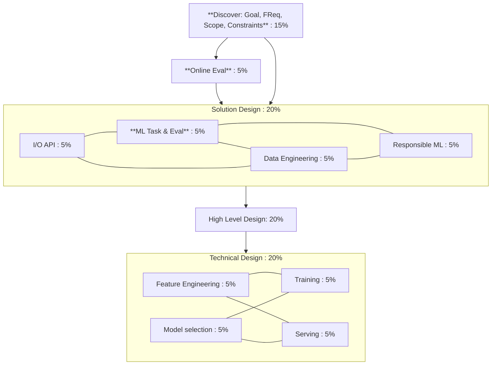
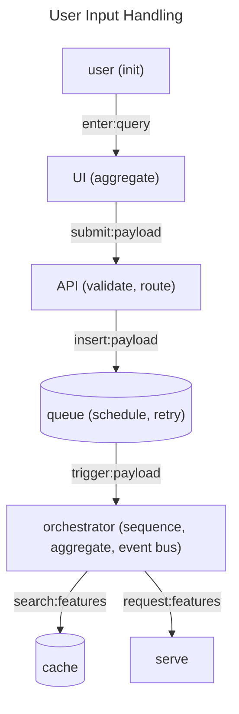
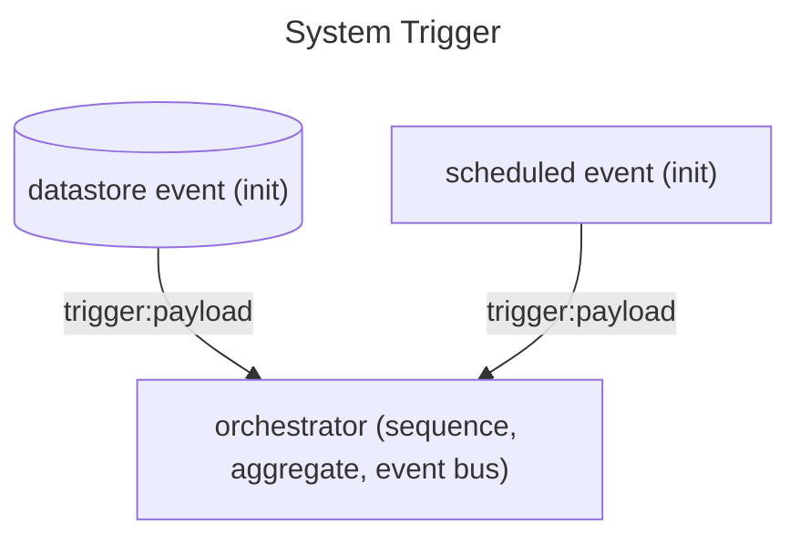
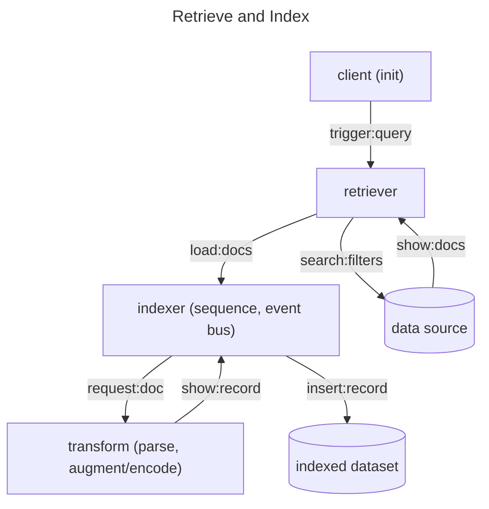
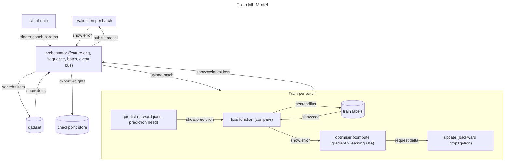
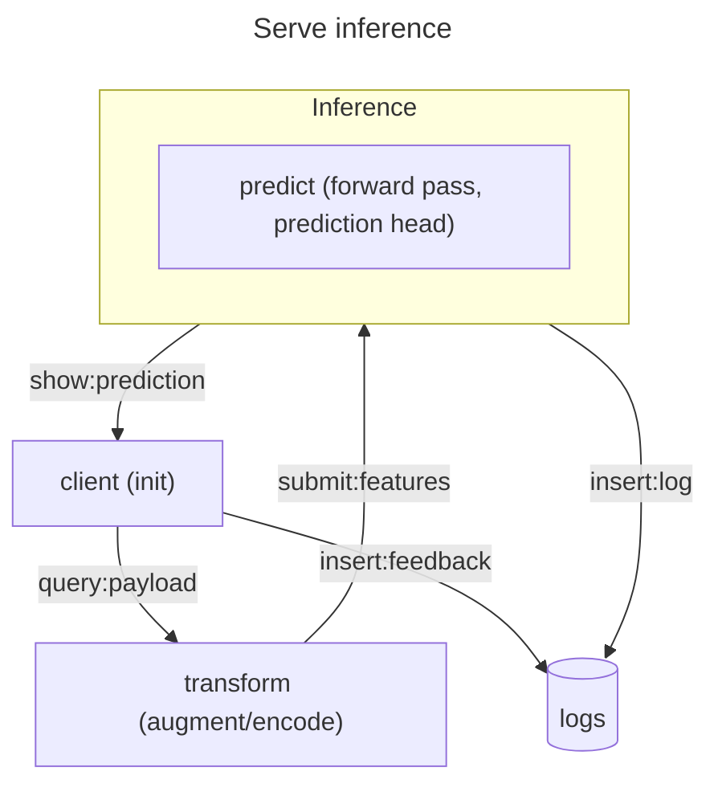
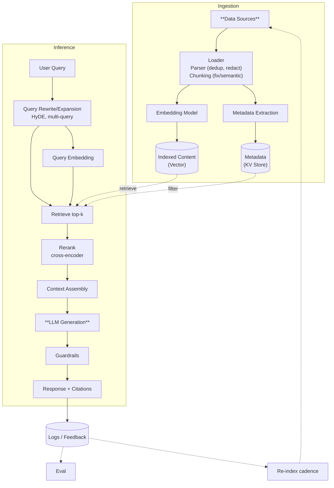

# ML System Design

Org certificate:

* [AI Platform on Microsoft Azure Specialization](https://teams.public.onecdn.static.microsoft/evergreen-assets/safelinks/2/atp-safelinks.html)
* [AWS Prescriptive Guidance](https://docs.aws.amazon.com/pdfs/prescriptive-guidance/latest/gen-ai-workload-assessment/gen-ai-workload-assessment.pdf)
* [GCP Audit Manager](https://cloud.google.com/products/audit-manager?hl=en)
* [ISO/IEC 42001](https://www.iso.org/standard/42001): [Azure ISO 42001](https://learn.microsoft.com/en-us/compliance/regulatory/offering-iso-42001); [AWS ISO 42001 FAQS](https://aws.amazon.com/compliance/iso-42001-faqs/); [GCP ISO 42001](https://cloud.google.com/security/compliance/iso-42001?hl=en)

## Outline

This outline  (4 + 2x4 blocks) is very high level and incomplete. The `: x%` is the estimated time spent on the component. Instead of a waterfall, an agile approach is recommended. Of course, we need to add security, pipelines, monitoring, etc. Normal to return to previous stages and adjust the direction.

> Business KPI ← online eval ← offline eval ← training loss. Between two is a surrogate relationship with a gap. Imperfect and comes with a risk: 
> * Business KPI: the bottom line metric to improve
> * Online eval: the real impact number to optimize for
> * Offline eval: the performance on the holdout test dataset 
> * Training loss: the model's loss on the training data



## Discover: Business Objective, Requirements, Scope (15%)

TL;DR: Definitions, KPI, QPS, Daily/Total Storage, Latency, Data Protection, Explainability

Definitions (similarity/personalized/engagement) in this business project context? Definition of success?

Business Objective, vision & goal. What is success? KPIs:

* 💰: annual recurring revenue ARR, net profit margin NPM
* 😊: customer acquisition cost CAC, churn rate, conversion rate CVR, customer lifetime value CLtV
* ⭐: customer satisfaction score CSat, net promoter score NPS
* 🚀: output per FTE, cost per task, cycle time per task
* 📦: average order value AOV, order fulfillment cycle time OFCT, inventory turnover COGS/avgINV
* 🔑: incident/breach count, data subject access request (DSAR) response time, mean time to detect/respond MTTD/MTTR

👍 Functional Requirements: UX, user journey, input/output modality, language requirement, continuous improvement, explainability

Scale of anticipated load:

* 🫀 Traffic: Query Per Second ($\text{DAU} \times \text{RequestCountPerUser} \times \frac{1}{86.4K \text{sec/day}}$), ingestion vs query frequency, avg vs max (+20%)
* 🐘 Data Volume: Daily Data Storage ($\text{DAU} \times \text{RequestCountPerUser} \times \text{RequestSize}$), Total Storage ($\text{Retention Period} \times \text{Daily Storage}$), rate of growth, avg vs max (+20%)

Constraints:

* ⏱️: latency budget (time to first meaningful byte, batch/real-time/stream), roundtrip EU-US: 150ms, within same datacentre 0.5ms
* 🔍: interpretability, explainability
* ☁️: data protection/sovereignty, [CAP Theorem](#cap-theorem), redundancy (99.9% down 9hr/yr, 99.999% down 5min/yr)
* 📖: cost of data gathering (labelling)
* 🖥️: deployment on hardware (edge device, server)

Other:

* Project history: existing baseline, new target
* Existing data sources


## Online eval (5%)

Prevalence

User feedback:
  * Explicit feedback (strong signal but few): User likes, valid dislike/escalation/complaint (hard negative), Perceptual Mean Opinion Score (MOS)
  * Implicit feedback (noisy signal but abundant): Click-through rate (CTR, clickbait risk), conversion rate (# conversions / # impressions), Repeated Purchase Rate (RPR), query reformulation rate, watch/dwell time, completed watch, successful clicks, share clicks

Operational performance:

  * [self-service (deflection) rate](#self-service-deflection-rate) (no-escalation-trick risk)
  * time-to-process/detect, dwell time, stockout/overstock cost
  * SLA breach rate, fraud $ prevented, revenue error

Safety:
  * field incident / miss rate
  * time to mitifave


## Solution Design: I/O API, ML Task Framing, Data Engineering, Responsible ML


### I/O API (5%)

I/O spec:
 
* input → output schema {attr: data type}
* at what granularity (user / item / pair / session),
* what cadence (one-shot vs sequential)
* idempotency (with request id of retries)
* pagination and versioning

Label spec:

* exact positive definition,
* source (explicit / implicit / synthetic)
* proxy risks

API type:

* REST (simple CRUD with HTTP),
* GraphQL (selective query),
* WebSocket (real-time two-way over TCP),
* SOAP (secure XML),
* gRPC (high-speed service-to-service)


###  ML Task Framing (business → ML) (5%)

Task from label availability: supervised / self-supervised / unsupervised / RL.

Idiosync
* Point ranking is a binary clf problem where $x$ consists of query $q$ (eg. user) and doc $d$ (eg. ad), and $q$ and $d$ are from two different domains

| Task framing | Mapping | Ground truth | Offline eval |
|---|---|---|---|
| Regression | $x → y∈ℝ$ | (x, y∈ℝ) | [MAE](#mae), [RMSE](#rmse), [wMAPE](#mape), [R²](#r) ... on [temporal split](#temporal-split) | 
| Interval Regression | $x → (y^-,y^+)∈ℝ$ | $(x, y^-,y^+)$ | [interval coverage](#interval-coverage) |
| Time Series Forecast | $(...,x_{t-1}) → y_t∈ℝ$ | $(...,x_{t-1}, x_{t})$ + covariates, horizon values | wMAPE, [MASE](#mase) on [temporal split](#temporal-split), [interval coverage](#interval-coverage) | 
| Binary clf w/o imbalance / multi-task (K binary heads) | $x → \{0,1\}$ | (x, y∈{0,1}) | [P](#precision)/[R](#recall)/[Fβ](#f1)@(0..1), [P@fixed-FPR](#precision), [PR-AUC](#pr-auc) w imbalance, [ROC-AUC](#roc-auc) w balance, [ECE](#calibration-ece)  |
| Point ranking | $(q,d) → \{0,1\}$ | (q, d, {0,1}) |  |
| Multi-class clf | $x → y∈K$ | (x, y∈K) | per-class/macro [P](#precision)/[R](#recall)/[Fβ](#f1), [Accuracy](#accuracy), [Hamming loss](#hamming-loss) | 
| Multi-label clf | $x → Y⊆K$ | (x, Y⊆K) | per-class/macro [P](#precision)/[R](#recall)/[Fβ](#f1), [Accuracy](#accuracy), [Hamming loss](#hamming-loss) | 
| Clustering | $x → x∈K/\text{Centroid}/\text{Prototype}$ / G=(X,E)+sim(i,j)∈E | x∈K ∀x∈X  | [Silhouette](#silhouette), [Davies-Bouldin](#davies-bouldin), [Calinski-Harabasz](#calinski-harabasz), + stability across samples, labels exist:[ARI](#ari) or [NMI](#nmi) | 
| Encoding | $x → \hat{x}$ | (x, 1x similar, n-1 dissimilar) | [R](#recall)@k, [MRR](#mrr), [Silhouette](#silhouette), [Davies-Bouldin](#davies-bouldin), [Linear probe](#linear-probe) |
| Retrieval | $q → Y⊆K$| (q, TPs, sample TNs) | [HitRate](#hitratek)@k, [R](#recall)/[P](#precision)@k, [diversity](#diversity), [catalog coverage](#catalog-coverage), [TF-IDF](#tf-idf), [BM25](#bm25) |
| Pair Ranking | $q → d^{-}<d^{+}$ | (q, 2x scored d) |[MRR](#mrr), [Pairwise Accuracy](#pairwise-accuracy), [ROC-AUC on ordered pairs](#roc-auc-on-ordered-pairs) |
| List Ranking | $q → sorted(D)$| (q, k scored d) | [mAP](#map), [nDCG](#ndcg)@k |
| Text sequence labeling | ? | (token seq, per-token/span boundary labels) | text sequence pairwise or span-level micro [F1](#f1)/[ARI](#ari) |
| Generate text2text | $t → \hat{t}$ | $(t, \hat{t})$; preference pairs $(t, \hat{t}^+, \hat{t}^-)$ | [BLEU](#bleu), [GLEU](#gleu), [METEOR](#meteor), [ROUGE](#rouge), [RAGAS metrics](#ragas-metrics), [safety rates](#safety-rates), [perplexity](#perplexity) |

| WIP Task framing | Mapping | Ground truth | Offline eval |
|---|---|---|---|
| Reinforcement Learning | | | | |
| Translation text2text | $t → t'$ | BLEU n-gram comparison for translation, METEOR extended BLEU, GLEU sentence-level BLEU |
| Transscript/Dictate T2S/StT | | [WER](#wer) for STT/TTS | |
| Image object localization |  |
| Image object detection | | [mAP](#map)@[.5:.95], [mAP](#map)@[IoU](#iou), per-class recall, FPS | (image, boxes + classes) |
| Image semantic segmentation | img → set(bbox) | (img, set[pixel-wise mask with object class]) | [P](#precision)@[IOU](#iou), [AP](#ap), [mAP](#map) | 
| Image object segmentation | img → set(labelled bbox) | (image, set[pixel-wise mask with object id]) | mIoU, obj boundary [mAP](#map)@[IoU](#iou), 1-vs-all recall, FPS |
| Generate text2img | t → img | (t, pixels) | [Inception Score](#inception-score), [FID](#fid) |
| Strategy Development (RL) | | | |
| Combinatorial optimisation | $(f(x)≤C, z(x)) → x$| asymm costs | |
| Anomaly detection |  $x → \{0,1\}$ | $(x,\{0,1\}) ∀ x∈X$ $ | precision@k alerts, PR-AUC on labeled slice, alert volume  |
| Causal effect | | | |


### Data Engineering (5%)

Clarification: Data source, size, type, ground truth labels

Data Objects: names

Data Gathering and Cost:

* hand labeling (explicit feedback, human judge, select or order)
* natural labeling (implicit feedback, interactions, results, if applicable)
* synthetic data

Data schema: field name, data type (numerical discrete vs continuous, categorical ordinal vs nominal), is pkey, is nullable, foreign key.

Data store: [CAP Theorem](#cap-theorem)

* Blob: Bucket in S3/GCS, Azure SA Container
* Tabular row-based: vertically scalable, reliability, [ACID](#acid), RDBS, MySQL, PostgreSQL
* Column-based: Cassandra, HBase, RedShift
* Key/Value: horizontally scalable, dynamic schema, Redis, DynamoDB, CosmosDB
* Document: MongoDB, CouchDB
* Graph: Neo4J

### Responsible ML (5%)

* Failure modes, misuse
* HITL
* Guardrails: api, intent classification, GenAI alignment with RLHF, output classification
* Fairness and bias (age, gender, ethnicity) with contrastive evaluation
* Watermarking (Coalition for Content Provenance and Authenticity, C2PA)
* [PUPPET](#puppet)


# High Level Design (20%)

legend: 
* act["actor (init)"] --action:data--> act["actor (process)"]
* act["actor (process)"] --action:data--> db[("datastore")]

### Trigger





### Data Gathering



### Train



### Serve



### Recommend: Retrieve + Rank

### RAG



### Object detection

TODO

### Image Segmentation

TODO

### Continous Learning

TODO

### TODO

* load balance before VM/node
* cache (memory is fast, disk is slow)
* partitioning logic
* indexing
* proxy (edge node)
* queue (priority, retry with dead letter)
* redundancy & replication

## Technical Design: Feature Engineering, Model selection, Training, Serving (20%)

Realistic system: add complexity only if justified

### Feature Engineering (5%)

* balance dataset (over vs under sampling),
* handle missing values (deletion, imputation)
* data transform:
    * numerical: scaling (normalization = min-max scaling, standardization = z-score normalisation, log scaling), discretization (bucketing) log-transform skewed targets, clip outliers
    * categorical: encoding (enumerating, one-hot encoder, embedding learning), 
    * natural language: stemming & lemmatization (remove stop words), tokenization, embedding
    * image: resize, crop, rotate, color shift, color mode (RGB/CMYK)
    * audio: ?


### Model Selection: (task → models → pitfalls) (5%)

1. Non-ML baseline first: popularity / rules / heuristic. ML must beat this.
2. Candidate framings (2–3 of the SAME problem), e.g. recommendation sys as pairwise ranking vs retrieval+ranking.
3. Pick one; reject runner-up against: label cost, metric alignment, latency, data volume, interpretability.

Idiosync:
* Time Series Forecast: leakage through future-known covariates; hierarchical reconciliation
* Binary clf: class weights over naive oversampling; recalibrate after any resampling; threshold from cost matrix, not 0.5; label delay (chargebacks arrive weeks late) / multi-task (K binary heads)
* Point rank: position bias (position feature at train, fixed at serve, or IPS); temporal split; negative downsampling then recalibrate
* Multi-class clf (per-class thresholds; handle imbalance, taxonomy drift over time)

| Task | Baseline | Advanced | ML head | ML loss | 
|---|---|---|---|---|
| Regression | (weighted) avg/median, linear regr, DT + beg/boost  | NN | single scalar | [MSE](#mse) / [Huber](#huber-loss) |
| Interval Regression | segment P## | | [quantile heads for intervals](#quantile-heads-for-intervals) | [pinball for quantiles](#quantile-heads-for-intervals) |
| Time Series Forecast | segment (weighted) avg/median, Holt-Winter's method, ETS/ARIMA | GBDT on lag features, Prophet, DeepAR, TFT | per-horizon point / quantile outputs | MSE / pinball |
| Binary clf w/o imbalance  | majority cls, rule based, log regr, DT + beg/boost | [Bert](#bert), DCN / DLRM | [sigmoid p(y)](#sigmoid-function) | ([Weighted](#weighted-bce)) [BCE](#bce--logloss); [Focal loss](#focal-loss), multi-task [weighted sum of losses](#weighted-sum-of-losses) |
| Point ranking | | | | |
| Multi-class clf | majority cls, 1vsAll log regr, decision tree with bagging/boosting, random forest, naive bayes, SVM | [Bert](#bert), [CNN](#cnn) | [softmax](#softmax) over K | [CE](#ce); [KL-divergence](#kl-divergence) |
| Multi-label clf | majority cls | | [sigmoid](#sigmoid-function) p(k) ∀k∈K | per-label [weighted BCE](#weighted-bce) |
| Clustering | K-means, GMM | DEC | [K-means with SSE](#k-means-inertia--sse) / [GMM with negative log-likelihood](#gmm-negative-log-likelihood) / [DEC with KL loss](#dec-with-kl-loss) | |
| Encoding | integer encoding, one-hot, [BoW](#bow), [Word2Vec](#word2vec) | Elmo, BERT, BLOOM, Contrastive Learning | embedding vector | [CE](#ce) / [InfoNCE](#infonce) / [triplet loss](#triplet-loss) |
| Retrieval | [kNN](#knn), [Apache Lucene](#apache-lucene) | [ANN](#ann) | dot/cosine (of 2 embeddings) | [InfoNCE](#infonce) / sampled [softmax](#softmax) / [triplet loss](#triplet-loss) |
| Pair Ranking (in-batch negatives + hard-negative mining; logQ sampling correction; cold-start via content features) | rule-based, embedding based, heuristic, log regr w/ feature crosses; GBDT | [matrix factorization](#matrix-factorization) with ALS, Two Towers + HNSW/ScaNN, [RankNet](#ranknet) | 2x scalar score s(q,d)  | [BCE](#bce--logloss) / [Hinge ranking loss](#hinge-ranking-loss) |
| List Ranking (split by query, never by doc; click labels are biased vs human judgments) | rule-based, mbedding based, heuristic | content-based, collaborative filtering, cross-encoder re-ranker, [ListNet](#listnet) / [LambdaRank](#lambdarank)-[LambdaMART](#lambdamart) | k scalar scores s(q,d) | [CE](#ce) |
| Text named entity segmentation | | |  per-token [softmax](#softmax) / CRF | token-level [CE](#ce) or CRF-NLL |
| Generate text2text (hallucination guardrails) | prompt eng, composite (RAG) | PEFT, Transformer | [softmax](#softmax) over VOCAB | next-token [CE](#ce) for supervised fine-tuning; [DPO](#dpo) on preferences |
| Image object detection (flip/crop/color augmentation; [NMS](#nms) and anchor tuning; small-object failure mode) | | YOLO family; Faster R-CNN; DETR, transfer-learn | box regression + class scores + objectness | composite: IoU/smooth-L1 + focal CE |
| Image object localisation | | [RPN](#rpn), box regression + class scores + objectness | mAP@IoU 0.5 | composite: IoU/smooth-L1 + focal CE |
| Image object segmentation | | ? + [NMS](#nms) | per-pixel [softmax](#softmax), dense FCN/U-Net/Mask decoder | per-pixel [CE](#ce) + Dice-IoU loss |
| Anomaly detection ("normal" training data is contaminated; threshold set by alert budget, not statistics; feed confirmed alerts back as labels) | isolation forest; autoencoder; one-class SVM | 3 | per-metric z-score / quantile threshold | reconstruction error / one-class objective |


### Training

Model architecture
* number of stages: one vs multi-stage, early vs late fusion (simpler vs native combined understanding)

Regularization: 
* dropout
* weight regularization: lasso k*sum|w|, ridge k*sum w^2, elastic net
* early stopping
* batch normalization


Model training/fitting:

* dataset: data split to training, validation (k-fold), test (hold-out)

* approach: forward feed (layers, bias, activation function, softmax) and backward propagation, contrastive training (feature= query + n objects, label = idx of object among n with highest similarity)
* distributed training: PyTorch Distributed Data Parallel (copy model, forward minibatch, aggregate loss, sync gradients, update all)
* Optimisation: stochastic gradient descent, weighted alternating least squares

Inference Serving:

* data ingestion, data indexing pipeline
* latency budget: batch vs real-time, streaming output
* Caching
* Re-training cadence
* host: cloud vs on-device
* pipeline: stages, gates
* model compression: quantization, knowledge distillation, pruning
* monitoring, hardware utilisation, requests/responses, drift in performance (model/data/context drift)


# Roadmap & Summary

* MVP to V1 to V2
* release strategy: p-value, shadow deployment, canary release for bug focus, A/B testing quality focus
* Priorities to de-risk
* What to delegate to others

# TODO

* ensemble: bagging vs boosting
* decision tree with boosted gradients?
* convolutional NN CNN

# Definitions


## CAP Theorem

Consistency, Availabiltiy, Partition Tolerance. Partition Tolerance is required to scale the system, however, the three together is impossible, so chose CP for with some downtime, or AP with delayed consistency.

## ACID

Atomicity, Consistency, Isolation, Durability

## Self-service (deflection) rate

Self-service (deflection) rate is the percentage of customer issues resolved entirely through automated/self-serve channels (chatbot, help center, FAQ, IVR menu) without ever reaching a human agent. It's called "deflection" because the goal is to divert (deflect) volume away from costly human support.

## PUPPET

https://arxiv.org/html/2603.20907v4 (Jul 2026)

PUPPET is a theoretical framework for identifying and evaluating manipulation in LLM-human dialogue based on identification (is it manipulative) and evalution (is it wrong or right).

It contains a dataset of 1000+ chat conversations to predict impact. PUPPET shifts focus from detecting how manipulation happens linguistically to predicting what effect it actually has on human beliefs.

## Accuracy

> classification metric

Accuracy is the fraction of all predictions that are correct. It counts correct decisions. For binary classification, with total samples $n$:

$$
\text{Accuracy} = \frac{TP+TN}{n}
$$

## Hamming loss

> classification metric

The Hamming loss is the fraction of labels that are incorrectly predicted. It counts mistakes. 

In a binary setting it is:

$$
\text{Hamming loss} = \frac{FP+FN}{n} = 1 - \text{Accuracy}
$$

In multiclass classification, the Hamming loss corresponds to the Hamming distance between $y$ and $\hat{y}$. which is equivalent to the subset $zero_one_loss$ function, when normalize parameter is set to True.

In multi-label classification, Hamming loss is more forgiving than the subset zero-one loss in that it penalizes only the individual labels.

## MAE

> regression metric

Mean Absolute Error is the average absolute difference between predictions and true values. Same units as the target (easy to interpret). Every error contributes linearly, so a Kx bigger error counts Kx more.

$$
MAE = \frac{1}{n} \sum |y-\hat{y}|
$$

## MSE

> regression loss

Mean Squared Error: squares the error, so large mistakes get penalized heavily. But it is sensitive to outliers.

$$
MSE=\frac{1}{n}∑(y−\hat{y})^2
$$

## MASE

TODO

## Huber loss

> regression loss

Huber loss is a hybrid of squared error and absolute error. For small errors it behaves like MSE, and for large errors it behaves more like MAE. Use when labels are noisy or occasional extreme values would otherwise dominate training.

$$
L_δ(r)=\begin{cases}
\frac{1}{2} r^2 & \text{if} |r| ≤ δ \\ 
δ(∣r∣−(1/2)δ) & \text{if} |r| > δ
\end{cases}
$$

$$
L_{Huber} = \frac{1}{n} \sum L_δ(y−\hat{y})
$$
 
where $r=y−\hat{y}$.

## RMSE

> regression metric

Root Mean Squared Error is the square root of average squared error, so it penalizes large errors more heavily. It is in the same units as y, and is sensitive to outliers.

$$
RMSE = \sqrt{\frac{1}{n} \sum (y - \hat{y})^2}
$$

## MAPE

> regression metric

Mean Absolute Percentage Error is the average absolute error as a percentage of the true value. It is scale-free (%), easy to explain to business users. But it can be unstable or undefined when $y \approx 0$.

$$
MAPE = \frac{100\%}{n} \sum |\frac{y_i-\hat{y_i}}{y_i}|
$$

Weighted Mean Absolute Percentage Error weights each error by the actual value, making it more stable for intermittent or low-volume data. Prefered in forecasting because it reflects total error relative to total volume rather than treating each item equally.

$$
wMAPE = \frac{\sum |y - \hat{y}|}{\sum |y|} \times 100\%
$$

## R²

> regression metric

$R^2$ is the coefficient of determination, a regression metric for how much variance in $y$ your model explains.

Interpretation:
* $R^2 = 1$: perfect prediction
* $R^2 = 0$: no better than predicting the mean
* $R^2 < 0$: worse than the mean baseline

$$
R^2 = 1 - \frac{ \sum (y-\hat{y})^2}{ \sum (y-\bar{y})^2}
$$

where $\bar{y} = \frac{1}{n} \sum y$ 

## Interval coverage

> regression metric, uncertainty

Interval coverage measures how often the true value falls inside the predicted interval.

For prediction intervals $[L,U]$ and targets $y$, empirical coverage is:

$$
Coverage = \frac{1}{n} \sum 1(L \le y \le U)
$$

where $1(.)$ is the indicator function.

## temporal split

> validation methodology

Temporal split of the dataset respects time order: train on older data, validate on newer data. Also called: rolling-origin backtest.

Instead of randomly splitting examples, you split by timestamp so the model is evaluated the way it will be used in production.

Why it matters:

* It prevents leakage from the future into the past.
* Random splits can make results look better than they really are when adjacent events are highly correlated.


## quantile heads for intervals

> regression technique, uncertainty

Quantile heads give you prediction intervals directly, without assuming a distribution. Instead of one output predicting the mean, you output several quantiles (say 0.05, 0.5, 0.95), and the gap between the low and high ones is your interval.

The whole trick is the loss function — the pinball loss (a.k.a. quantile / check loss). For a target quantile τ:
```python
import torch
def pinball_loss(y_true, y_pred, tau):
    e = y_true - y_pred
    return torch.mean(torch.max(tau * e, (tau - 1) * e))
```
For τ=0.5 it's symmetric and you recover the median (MAE).
The asymmetry is what makes it work for quantiles: for τ=0.95 it penalizes under-prediction ~19× harder than over-prediction, so the model learns to sit above 95% of the data.

Architecture — one shared trunk, one linear head per quantile:
```python
import torch; import torch.nn
class QuantileRegressor(nn.Module):
    def __init__(self, in_dim, quantiles=(0.05, 0.5, 0.95)):
        super().__init__()
        self.quantiles = quantiles
        self.trunk = nn.Sequential(
            nn.Linear(in_dim, 128), nn.ReLU(),
            nn.Linear(128, 64), nn.ReLU(),
        )
        self.heads = nn.ModuleList(nn.Linear(64, 1) for _ in quantiles)

    def forward(self, x):
        z = self.trunk(x)
        return torch.cat([h(z) for h in self.heads], dim=1)  # (B, n_quantiles)
```

Training loop sums the pinball loss across heads:
```python
def multi_quantile_loss(preds, y_true, quantiles):
    y_true = y_true.unsqueeze(1)
    losses = []
    for i, tau in enumerate(quantiles):
        e = y_true - preds[:, i:i+1]
        losses.append(torch.max(tau * e, (tau - 1) * e))
    return torch.mean(torch.cat(losses, dim=1))
```
At inference, pred[:, 0] and pred[:, 2] are your 90% interval bounds, pred[:, 1] is the median.
The one gotcha: quantile crossing. Since the heads are independent, nothing stops the model from predicting q05 > q95 in some regions. 

Fixes, cheapest first:
* Sort the outputs post-hoc (torch.sort along the quantile dim) — simple, works fine for most cases.
* Monotone parameterization: predict the lowest quantile plus non-negative increments, e.g. q_k = q_0 + cumsum(softplus(deltas)). Guarantees ordering by construction.
* Single-head conditional quantile: feed τ as an input and train on random τ per batch — one head, infinitely many quantiles, no crossing if you enforce monotonicity in τ.

## Sigmoid function

> activation function

The sigmoid function maps any real number to a value between 0 and 1:

$$
\sigma (z) = \frac{1}{1+e^{-z}}
$$

$σ(0)=0.5$; as $z → +∞, σ(z) → 1$; az $z → -∞, σ(z) → 0$; 

## Silhouette

> clustering separability

Silhouette measures how well each point matches its own cluster versus other clusters. Points should be close to their own cluster and far from others.

$$
s_i = \frac{b_i -a_i}{\max(a_i,b_i)}
$$

where $a_i$ is avg distance to points in the same cluster, $b_i$ is avg distance to the nearest other cluster. Range is [-1,1], higher is better.

Intra-cluster distance is the distance among points inside the same cluster. Points in the same group should be compact. Usually you want it small.

$$
d_{intra}(k) = \frac{1}{|C|} \sum ||x-\mu||^2
$$

where $\mu$ is the centroid of cluster $C$

Inter-cluster distance is the distance between different clusters. Different groups should be far apart.Usually you want it large. 

$$
d_{inter}(a,b) = ||\mu_a - \mu_b||
$$
where $\mu_i$ is cluster centrod

## Davies-Bouldin

> clustering separability

Davies-Bouldin measures avg “similarity” between each cluster and its most similar other cluster. Lower is better, compact clusters that are well separated get a low score. It penalizes clusters that are spread out or overlap.

## Calinski-Harabasz

> clustering separability

Calinski-Harabasz ratio of between-cluster dispersion to within-cluster dispersion. Clusters should be tight inside and far apart from each other. Higher is better.

$$
CH = \frac{\text{between-cluster variance} / (K-1)}{\text{within-cluster variance} /(N-K)}
$$

## Linear probe

> clustering separability

Linear probe is a practical test of representation quality. If an additional simple linear layer can provide a good Accuracy/F1/AUC, then the representation already contains useful, separable information. The embeddings stay fixed; only the linear classifier is learned. Better probe performance usually means the embedding space is more informative and linearly separable.

Steps:
1. Freeze encoder
2. Extract embeddings
3. Train logistic regression or linear classifier
4. Measure Accuracy/F1/AUC.

## ARI

> clustering metric (vs ground truth)

Adjusted Rand Index compares pairwise agreement between predicted clusters and true labels. Adjusted for chance. Range is roughly [−1,1], where 1 is perfect, 0 is random-like.

Requires: ground truth labels

## NMI

> clustering metric (vs ground truth)

Normalized Mutual Information measures shared information between cluster assignments and true labels. If clusters align well with labels, mutual information is high. Range is [0,1], higher is better.

Requires: gound-truth labels

## K-means inertia / SSE

> clustering loss

K-means inertia is the standard K-means objective: sum of squared distances from each point $x$ to its assigned cluster centroid $\mu$. Clusters should be compact. Points should lie close to their centroid.

$$
SSE = \sum ||x - \mu||^2
$$

Issues: hard clusters

## GMM negative log-likelihood

> clustering loss

For a Gaussian Mixture Model, the objective is the negative log-likelihood of the data under the mixture. The model should assign high probability to the observed data. Clusters can be soft, not just hard assignments.

## DEC with KL loss

> clustering loss

Deep Embedded Clustering learns a representation and cluster assignments jointly using a KL-divergence loss between a soft assignment distribution $q_{ik}$ and a target distribution $p_{ik}$. The model starts with soft cluster probabilities. It sharpens them using a target distribution. It encourages points to move toward more confident cluster centers. It is representation learning plus clustering together.

$$
\mathcal{L}_{\text{DEC}} = KL(P||Q)=\sum \sum p_{ik} \log \frac{p_{ik}}{q_{ik}}
$$

## Precision

> classification metric

Precision answers: “Of all items predicted positive, how many were truly positive?” High precision means few false alarms.

$$
P = \frac{TP}{TP+FP}
$$

Precision@fixed-FPR means:

$$
\text{Precision}|\text{FPR=α}
$$

1. Choose an acceptable false positive rate target, say $FPR=α$ (for example 0.01).
2. Tune the score threshold so the model operates at that FPR on validation data.
3. Report precision at that operating point.

If you cap $FPR$ at 0.5%, and precision there is 40%, then about 4 in 10 selected items are real positives while staying within your false-alert budget.

Issues:

* does not consider ranking quality
* ceiling effect: $P@k = \frac{TP@k}{K}$ but if Positive count is low ($< k$), then P@k has upper bound, P@k can be punished for low $k$

## Recall

> classification metric

Recall answers: “Of all truly positive items, how many did we catch?” It is the true positive rate. High recall means few misses.

$$
R = \frac{TP}{TP+FN} = \frac{TP}{|\text{Positives}|}
$$

Issues:

* Does not consider ranking quality
* ceiling effect: $R@k = \frac{TP@k}{|Positives|}$ but if Positive count is large ($> k$), then R@k is punished for low k

## F1

> classification metric

F1 is the harmonic mean of precision and recall.

$$
F1 = \frac{2PR}{P+R}
$$

Why it is used:

* Balances precision and recall in one number.
* Useful when class imbalance exists and both false positives and false negatives matter.
* Range is [0,1]; higher is better.

F-beta, $F_β$, score is the weighted harmonic mean of precision and recall.

$$
F_β = \frac {(1 + β²) × (Precision × Recall)}{β² × Precision + Recall}
$$

* $β > 1$: emphasizes recall
* $β < 1$: emphasize precision

## PR-AUC

> classification metric, threshold-free

Area under the Precision-Recall curve: plot precision vs recall across thresholds, then take the area. The baseline is roughly the positive class prevalence: 

$$
\text{baseline}=\frac{\text{nb.positive}}{\text{nb.all.samples}}
$$

Why it is useful:
* Focuses on positive-class performance.
* Higher is better;  1.0 is perfect.
* More informative than ROC-AUC on highly imbalanced data.

$$
\text{PR-AUC} = \int_{0}^{1} P(R)\,dR
$$

where $P(R)$ is precision as a function of recall.


## ROC-AUC

> classification metric, threshold-free

The Area Under the Receiver Operating Characteristic curve. It plots:

True Positive Rate (ie. recall): $TPR = \frac{TP}{TP+FN}$

False Positive Rate: $FPR=\frac{FP}{FP+TN}$

for all classification tresholds.

$$
\text{ROC-AUC} = \int_{0}^{1}\mathrm{TPR}(\mathrm{FPR})\,d(\mathrm{FPR})
$$

Interpretation:

* $AUC = 1.0$: perfect ranking.
* $AUC=0.5$: random ranking.
* Probability view: ROC-AUC equals the probability a random positive gets a higher score than a random negative.

It measures ranking quality, not calibration. Two models can have the same ROC-AUC but very different predicted probabilities.


## Calibration (ECE)

> calibration metric

Calibration means predicted probabilities should match observed frequencies. 

Expected Calibration Error (ECE) is a summary of mismatch. Intuition: predictions around 0.8 should be correct about 80% of the time. If they are correct only 65%, the model is overconfident in that region.

Reliability curves (aka calibration plots): $y=z$: perfect calibration on the diagonal, above diagonal the model is underconfident, below diagonal the model is overconfident.

1. Bin predictions by confidence [(0.0-0.1), (0.1-0.2),...]
2. For each bin, compute avg predicted probability and observed positive rate
3. Plot observed rate (y-axis) vs predicted confidence (x-axis)

Platt scaling: post-hoc calibration method, mainly for binary classification, fits a logistic mapping from model score $s$ to calibrated probability: $\hat{p}=σ(As+B)=\frac{1}{1+e^{-(As+B)}}$ where $A$, $B$ is learned on validation set.

Isotonic regression: post-hoc non-parametric calibration method for binary classification, requires large calibration dataset. Learns a monotonic function $f$ such that $\hat{p}=f(s)$, where $f$ is non-decreasing. More flexible than Platt scaling, it can fit complex shapes, but can overfit with small calibration data.

Temperature scaling: post-hoc calibration method for multi-class NN. Divides logits by temperature $T > 0$ before softmax: $\hat{p} = \frac{e^{z/T}}{\sum e ^{z/T}}$. Fir one scalar T on validation data. $1<T$ softens overconfident predictions, $0<T<1$ sharpens. Preserves class ranking (argmax usually unchanged), mainly fixed confidence values.

## Inception Score

> generative image metric

Inception Score rewards images that are individually classifiable (low entropy in $p(y|x)$) and globally diverse (high entropy in $p(y)$). Does not compare to real data directly, so it can be gamed and is less reliable than FID for many modern settings. Higher is better.

## FID

> generative image metric

Fréchet Inception Distance compares feature distributions of real vs generated images (features usually from an Inception network). Captures both quality and diversity mismatch. Sensitive to preprocessing, sample count, and implementation details. Lower is better.

$$
\text{FID} = |\mu_r - \mu_g|^2_2 + Tr(\Sigma_r + \Sigma_g - 2(\Sigma_r \Sigma_g)^{1/2})
$$
where real features have mean/covariance $(\mu_r, \Sigma_r)$ and generated features have $(\mu_g, \Sigma_g)$

## KL-divergence

> ditribution divergence

Kullback-Leibler divergence measures how one probability distribution $Q$ differs from a reference distribution $P$:

$$
D_{KL}(P||Q) = \sum P(x) \log \frac{P(x)}{Q(x)}
$$

(continuous version uses an integral).

Intuition:

* $D_{KL}=0$ only when $P=Q$ (almost everywhere)
* Larger value means $Q$ is a worse approximation of $P$.
* Not symmetric: generally $D_{KL}(P||Q) ≠ D_{KL}(Q||P)$

## CE

> classification loss

(Categorical) Cross-Entropy is used for one-of-K classes with true class vector $y_k$ (usually one-hot) and predicted class probs $p_k$ (typically the softmax output). It pushes probability mass onto the correct class.

$$
CE = - \sum y \log p
$$
​
For one-hot labels, this simplifies to 
$− \log p_{\text{true class}}$

Normalised CE (NCE) is model CE over baseline model's CE where baseline model is simpler (e.g. majority class).

## BCE / LogLoss

> classification loss

Binary Cross-Entropy (aka Logarithmic Loss, LogLoss for binary classification tasks) is the binary case of CE. It is used when target is $y∈\{0,1\}$ and model outputs probability $p=P(y=1∣x)$. It heavily penalizes being confidently wrong in binary classification, while creating a smooth (differentiable) curve. It treat every training example equally. For multi-label classification (several can be 1) we use independent BCE per label.

$$
\text{BCE} = \text{LogLoss} = - \frac{1}{n} \sum [y \log p + (1-y) \log (1-p)]
$$


## Weighted BCE

> classification loss, imbalance

Weighted Binary Cross-Entropy is a simple baseline used to counter class imbalance or asymmetric mistake costs. Weighted BCE says: “Mistakes on positives hurt more (or less), based on business need.” 

$$
L_{\text{WBCE}} = - \frac{1}{n} \sum [w_1 y \log p + w_0 (1-y) \log(1-p)]
$$

where $p$ is the predicted probability and label $y \in \{0, 1 \}$, $w_{\{1, 0\}}$ are up/down-weight positive and negative classes

## Focal loss

> classification loss, imbalance

Focal loss is for heavy imbalance with many easy negatives (e.g., detection, rare-event classification). It says: “Stop spending so much effort on easy examples you already get right. Focus on hard ones.” Easy examples get down-weighted automatically. Hard/misclassified examples keep large influence.

For binary classification:
$$
L_{\text{FL}} = - α (1-p_t)^{\gamma} \log (p_t)
$$

where $p_t = p \text{ iff } y=1 \text{ else } 1-p$, $p$ is the model’s estimated probability, and $α$ is the balance parameter.

## HitRate@k

> retrieval metric

HitRate@k is the probability of getting at least one hit in top-k. For each query, it checks whether at least one relevant item appears in top-k. Unlike Recall@k, it does not reward finding multiple relevant items once one hit is present.

$$
HR@k = \frac{1}{Q} \sum 1(\text{top-k} ∩ R \ne ∅)
$$

whre $R_q$ is the set of relevant items for query $q \in Q$

## DPO

> preference alignment loss

Direct Preference Optimization trains a NN on preference pairs (chosen response y+ vs rejected response y- for same prompt x). Instead of token imitation, it optimizes relative preference so model scores chosen outputs higher than rejected ones. It aligns style/helpfulness/safety preferences better than SFT alone.

## MRR

> ranking metric

Mean Reciprocal Rank rewards getting at least one correct result very early, but it ony considers the first. For each query $q$, find the rank of the first relevant result, $\text{rank}$. Reciprocal rank is $1/\text{rank}_q$ (or 0 if no relevant item found).

Then average over queries:

$$
\text{MRR} = \frac{1}{Q} \sum \frac{1}{rank}
$$

Issues:
* only considers the first relevant result

## AP

> ranking/detection metric

Average Precision rewards putting true positives early in the ranked list, not just finding them eventually For one query or one class, Average Precision (AP):

$$
\text{AP} = \sum P(k) \Delta R(k)
$$

where $P(k)$ is precision at cutoff k, and $\Delta R(k)$ is recall increase at k.

Issues:

* designed for binary relevances

## mAP

> ranking/detection metric

Mean Average Precision is used to aggregate AP over multiple classes. Same as AP, it rewards putting true positives early in the ranked list, not just finding them eventually

$$
\text{mAP} = \frac {1}{K} \sum \text{AP}
$$

where $AP$ is the Average Precision

Issues:

* designed for binary relevances (inherrited issue from to AP)

## nDCG

> ranking metric

Normalized Discounted Cumulative Gain handles graded relevance (not just relevant/irrelevant), and discounts lower positions. Range is [0, 1]. 

Intuition:
* Higher relevance at higher ranks gives more gain.
* Same relevant item lower down contributes less.
* Normalization makes scores comparable across queries.

For top-K results:

$$
\text{DCG@k} = \sum^K \frac{2^{rel_i} - 1}{\log_2 (i+1)}
$$

Compute ideal DCG (best possible ordering): $\text{IDCG@k}$

Normalise:

$$
\text{nDCG@k} = \frac{\text{DCG@k}}{\text{IDCG@k}}
$$

## Diversity

Avg pair-wise embedding distance

## Catalog Coverage

> recommendation metric

Catalog coverage is a recommendation metric that measures how much of the item catalog your system actually exposes in its recommendations.

Intuition:

* High coverage means recommendations are spread across many items (better exploration/diversity).
* Low coverage means the system keeps showing the same small subset of popular items.
* Coverage does not guarantee relevance, so it is usually tracked alongside precision, recall, or nDCG.

$$
\text{CatalogCoverage@k} = \frac{|⋃_{U} Rec^{@k}_{u}|}{|I|}
$$

where $U$ is the user set, $Rec^{@k}_{u}$ is the top-K items recommended to user $u$, $I$ is the full item catalog.

## Softmax

> activation function

Softmax converts logits $z_1, ... z_K$ into a probability distribution over $K$ classes:

$$
softmax(z)_i = \frac{e^{z_i}}{ \sum e^z}
$$

Properties:

* output is in (0,1)
* outputs sum to 1
* larger logit → largest class probability

Sampled softmax is an approximation of full softmax over a huge catalog. Instead of normalizing over all items, use the true item plus a sampled negative set.

## InfoNCE

> contrastive loss

InfoNCE treats retrieval as a classification problem: pick the true item among distractors. In-batch negatives are commonly used for efficiency. It is a strong default for two-tower retrieval. It helps models learn to distinguish between positive and negative samples by estimating mutual information.

$$
\mathcal{L}_{\text{InfoNCE}} = - \log \frac{e ^ {s(q,i^+)/\tau}}{e^{s(q, i^+) / \tau} + \sum e^{s(q,i^-)/\tau}}
$$

where $q$ is query embedding, $i^+$ is positive item, $i^-$ is negative, $s(.,.)$ is similarity and $\tau$ is temperature.

## Triplet loss

> contrastive loss

Triplet enforces ordering: positive must be closer than negative by at least margin m. It works best with hard or semi-hard negative mining. Used for metric-learning setups with explicit margin constraints.

$$
\mathcal{L}_{\text{triplet}} = \max (0, m + d(q,i^+) - d(q,i^-))
$$

where $q$ is the query, $i^+$ is positive, $i^-$ is negative, $d(.,.)$ is distance, and $m$ is margin.

## Weighted sum of losses

> multi-task training technique

The training loss is a weighted combination of several loss functions. Used to align model training with business value, and prevent one task/aspect dominating gradients. To choose weight use one of:
1. manual business priors,
2. normalise by label prevalence or loss scale
3. dynamic wighting methods (uncertainty weighting, GradNorm)

$$
\mathcal{L}_{\text{total}} = \sum w L
$$

where $L$ is a loss function, $w$ is weight controlling importance

## BLEU

> generative text metric

BLEU (Bilingual Evaluation Understudy) is a precision-oriented metric for translation/generation: it measures how many n-grams in the candidate also appear in the reference(s), then applies a brevity penalty so a model can't game precision by outputting very short text.

$$
\text{BLEU} = BP \cdot \exp\left(\sum_{n=1}^{N} w_n \log p_n\right)
$$

where $p_n$ is modified n-gram precision (clipped at reference n-gram counts) and $BP = \min(1, e^{1 - r/c})$ is the brevity penalty, with $c$ = candidate length, $r$ = reference length.

Issues:
* candidate-anchored (precision only) — says nothing about recall/coverage of the reference
* exact n-gram match only, so synonyms/paraphrases are penalized like errors
* designed for corpus-level aggregation; noisy at the single-sentence level

## GLEU

TODO

## ROUGE

> generative text metric

Recall-Oriented Understudy for Gisting Evaluation. Reference-anchored counterpart to [BLEU](#bleu): measures how much of the *reference* n-gram content is recovered by the candidate, so it fits summarization better (did the summary keep the key content?) than translation.

$$
\text{ROUGE-N} = \frac{\sum_{\text{ref n-grams}} \text{count}_{\text{match}}(n\text{-gram})}{\sum_{\text{ref n-grams}} \text{count}(n\text{-gram})}
$$

ROUGE-L uses longest common subsequence instead of fixed n-grams, so it tolerates word reordering/insertions better than ROUGE-N.

Issues:
* recall-only bias — a candidate that copies the entire reference scores well regardless of conciseness (usually reported alongside an F-measure or length constraint to offset this)
* same exact-match blindness to synonyms/paraphrase as BLEU

## METEOR

> generative text metric

Metric for Evaluation of Translation with Explicit ORdering. Extends BLEU by aligning candidate/reference words through exact, stem, synonym (WordNet), and paraphrase matches, then combines precision and recall (weighted toward recall) with a fragmentation penalty for word-order mismatch.

$$
F_{\text{mean}} = \frac{P \cdot R}{\alpha P + (1-\alpha) R}
$$

$$
\text{METEOR} = F_{\text{mean}} \cdot (1 - \text{Penalty})
$$

where the Penalty grows with the number of non-contiguous matched chunks (more fragmentation → larger penalty).

Correlates better with human judgment at the sentence level than BLEU (recall is included, and synonymy is credited), at the cost of needing language resources (e.g. WordNet) and being slower to compute.

## RAGAS metrics

> generative text metric (RAG)

Answer Relevancy \ Repeatability checks whether the answer truly addresses the question. LLM generates paraphrases of the question and measures semantic alignment.

$$
\text{Answer Relevancy} = sim(\text{Answer}, \text{Answer to Paraphased Q})
$$

Context Utilization (similar to BLEU) measures how much of the retrieved context is actually used. LLM detects which context portions were used or ignored. High utilization indicates strong grounding; low means hallucination.

$$
\text{Context Utilization} = \frac{|\text{n-grams present in context}|}{|\text{n-grams in Answer}|}
$$

Faithfulness measures (similar to BLEU) factual consistency between generated answer and retrieved context. LLM extracts claims and checks if evidence exists in context.

$$
\text{Faithfulness} = \frac{|\text{claims present in context}|}{|\text{claims in Answer}|}
$$

Noise Sensitivity (similar to Recall) tests robustness — how much output degrades when irrelevant text is added. LLM re-evaluates under noisy and clean contexts to detect sensitivity.

$$
\text{Noise Sensitivity} = 1 − \frac{\text{Faithfulness}_{noisy}}{\text{Faithfulness}_{clean}}
$$


## Safety rates

> generative safety metric

self-harm content, hateful or unfair content, violent content, sexual content, protected material, indirect attack/jailbreak


## Perplexity

> generative text metric

Perplexity measures how well the model predicts the reference next tokens. It is roughly the model's average branching uncertainty per token. Good for fluency/fit to reference text, but not enought for usefulness or safety. Likelihood-based, token-level fit.


## Pairwise Accuracy

> pairwise ranking metric

Pairwise Accuracy is the fraction of pairs that are ordered correctly. Pairwise accuracy is threshold-free only in the sense of direct comparison inside each pair.

$$
\text{PairwiseAcc} = \frac{1}{N} \sum 1(s(q,d^+)>s(q,d^-))
$$

where $s(q,d)$ is the score of doc $d$ given query $q$.


## ROC-AUC on ordered pairs

> pairwise ranking metric

Treat pairwise ranking as a binary classification problem:
* positive pair if the ordering is correct
* negative pair if reversed

Then ROC-AUC measures how well these pair scores separate correctly ordered from incorrectly ordered pairs across all thresholds.

ROC-AUC for pairwise ranking is the probability that a randomly chosen positive ordered pair gets a larger margin than a randomly chosen negative ordered pair.

Interpretation:

*  1.0: every preferred document gets a higher score than the non-preferred 
* 0.5: random ordering.
Higher is better.

ROC-AUC is smooth and ranking-oriented across the full margin distribution, it is often robust for model comparison.

## IoU

TODO

## RankNet

> pairwise ranking method

RankNet turns the score gap into a probability that the preferred doc is above the other. It uses BCE on this pairwise probability. It has a smooth penalty; still gives gradient even when ordering is already correct, but smaller as margin grows. It is probabilistic, smooth, usually easy optimization.

$$
\Delta = s(q,d^+) - s(q,d^-)
$$

where $q$ is query, $d^+$ is preferred doc, $d^-$ is less-preferred doc, model score is $s(q,d)$.

$$
P = \sigma(\Delta)=\frac{1}{1+e^{-\Delta}}
$$

$$
\mathcal{L}_{\text{RankNet}} = - \log \sigma (\Delta) = \log (1+e^{-\Delta})
$$

## Hinge ranking loss

> pairwise ranking loss

Hinge ranking loss enforces a margin $m>0$ between preferred and non-preferred scores. It is more “hard-margin” style than RankNet. It is margin-based, focuses on violations only.

$$
\Delta = s(q,d^+) - s(q,d^-)
$$

where $q$ is query, $d^+$ is preferred doc, $d^-$ is less-preferred doc, model score is $s(q,d)$.

$$
\mathcal{L}_{\text{hinge}} = \max (0, m-\Delta)
$$

If $\Delta ≥ m$, loss is 0, else
$\Delta < m$ penalize linearly until margin is met.

## ListNet

> listwise ranking loss

ListNet turns each of the ground truth and predicted ranked lists into a probability distribution over "which item is top-1" — once from the true relevance labels, once from the model scores — then minimizes the divergence between the two. It considers the whole list at once, not just pairs.

Top-one probability for item $i$ among $k$ items:

$$
P(i) = \frac{e^{s_i}}{\sum_j e^{s_j}}
$$

Loss is CE between the true top-one distribution $P^y$ (from ground truth relevance $y$) and predicted $P^s$ (from scores $s$):

$$
\mathcal{L}_{\text{ListNet}} = - \sum_i P^y(i) \log P^s(i)
$$

## LambdaRank

> listwise ranking loss

LambdaRank extends [Pairwise logistic loss](#pairwise-logistic-loss) (RankNet) to optimize listwise ranking metrics directly. Since metrics like [nDCG](#ndcg) are computed on sorted ranks, they're flat almost everywhere and non-differentiable — so LambdaRank scales each pair's RankNet gradient by the change in nDCG that swapping that pair would cause, $|\Delta nDCG|$. Pairs whose swap would hurt nDCG a lot get pushed apart harder.

$$
\lambda_{ij} = \frac{\partial \mathcal{L}_{\text{RankNet}}}{\partial s_i} \times |\Delta nDCG_{ij}|
$$

where $s_i$ is the score of item $i$, and $\Delta nDCG_{ij}$ is the change in nDCG from swapping items $i$ and $j$ in the ranked list.
Technically a gradient heuristic rather than a loss with an explicit closed form.

## LambdaMART

> listwise ranking model + loss

LambdaMART is [LambdaRank](#lambdarank)'s $\lambda$ gradients used as pseudo-residuals to fit gradient-boosted regression trees (MART) instead of a neural net. It's the standard production learning-to-rank algorithm (LightGBM/XGBoost ranking objectives), combining metric-aware gradients with the strength of tree ensembles. It's LambdaRank's gradients applied to gradient-boosted trees (MART), so it's the model/algorithm, not just a loss.

## Bert

Bert, DistilBert

## CNN

TODO

## NMS

Non-Maximum Suppression is post-processing technique to eliminate redundant or overlapping predictions.

Outline:
1. Rank all detections by confidence score
2. Keep the detection with the highest score
3. Remove any other detections that overlap with it (based on an IoU threshold, typically 0.5)
4. Repeat with the next highest-scoring remaining detection

## BoW

Bag of Words (key-count, sparse representation)

## TF-IDF

normalized BoW

## BM25

TODO

## Matrix factorization

TODO

## Word2Vec

shallow NN, Continuous BoW + Skip-gram

## kNN

k Nearest Neighbour

## ANN

approximate (tree and/or cluster based, locally sensitive hashing, ScaNN, DiscScann, HNSW)

## Apache Lucene

retrieval/serving solution

implementations: Elasticsearch, Solr

## RPN

Region Proposal Network is a deep learning component used in object detection models to identify potential object locations within an image
